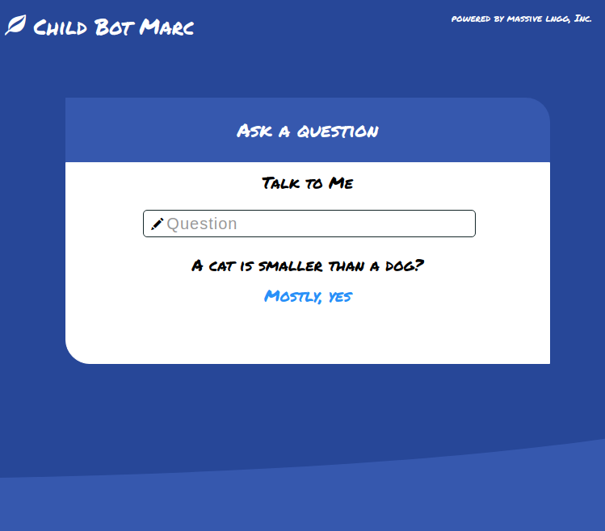

# Child Bot Marc  
Chatbot with child language ability using visual memory  
  
  
  
## overview  
chatbot software which can answer a question,  
using concept and knowledge learned from images, videos  
  
## successful example  
```  
input:Does a man rides on an elephant?  
bot answer:that's right  
input:A woman is smaller than a cat?  
bot answer:that's wrong  
input:Does a man wears a hat?  
bot answer:Mostly, yes  
input:A house is taller than a flower?  
bot answer:that's right  
input:Does a woman carries a bag usually?  
bot answer:In most cases, yes  
input:A cat is smaller than a car?  
bot answer:not likely  
input:Does a man rides on a motorcycle?  
bot answer:Yes, certainly  
input:Does a cat sleeps on a sofa?  
bot answer:In most cases, yes  
input:A cat is taller than a woman?  
bot answer:Mostly, no  
```  
  
## Requirements  
Python 3.6.8 :: Anaconda, Inc.    
pytorch 1.1  
torchvision 0.3.0  
flask 1.0.2  
ngram(pip install)  
nltk(pip install)  
Azure Bing Search v7(for image search)    
Azure Computer Vision(for object detection)    
Bootstrap 3 (optional)  
  
## how to setup  
  
### put the pretrained model under "engine/data/trained_model"  
rel_first_model.pth <download path> todo rev  
rel_second_model.pth <download path> todo rev  
  
### setup azure key  
1.get free microsoft azure account, setup Bing Search and Computer Vision API resource    
put your key to json secret file    
(Be careful not to expose, I strongly recommend to use free account)    
```  
{  
  "search_endpoint":"https://api.cognit...ve.microsoft.com/...",  
  "search_key":"yourkey",  
  "vision_endpoint":"https:...ve.microsoft.com/",  
  "vision_key":"yourkey"  
}  
```  
2.set the path of json secret file on "engine/azure/settingaz.py"  
```  
SECRET_FILE = "./engine/data/refer/azure_secret_sampl.json"(replace with your path)  
```  
  
## command to start  
```  
python app/app.py  
```  
When you use this only in your command terminal  
```  
python app/answer.py [question]  
```  
  
## pretrained concepts  
### image memory mode  
13 concepts total  
```  
smaller bigger taller lower  
drive sleep drink grow ride eat fly wear carry  
```  
There are objects which are easy to detect  
shown in "./engine/data/refer/synonyms.txt"  
```  
person man woman elephant cat flower cow wine bird banana...  
```  
### video memory mode  
only these questions are available  
"what do you imagine when you hear ~?"  
"what comes to your mind when you hear ~?"  
  
concepts in "./engine/data/refer/video_train.txt" are pretrained  
  
## how it works  
### image memory mode  
(1) noun and a keyword are extracted from the text input  
```  
(e.g) "The cat is smaller than the dog?" -> ["cat", "smaller", "dog"]  
```  
(2)crawl images and collect infomation by detecting objects using azure API  
  
(3)The collected image imformation is put into neural network  
and evaluate how much true the relation is  
```    
(e.g) subject:cat, relation:smaller, object:dog => score 0.47  
```  
The relation is detected by using "VTransE"  
"Visual Translation Embedding Network for Visual Relation Detection"  
Hanwang Zhang, Zawlin Kyaw, Shih-Fu Chang, Tat-Seng Chua.  
  
the codes work in the following order  
```  
(In ./engine directory)  
azure/image_search.py  
azure/vision_detect.py  
azure/azure_reldata.py  
  
A.main.py  
 or  
B.main_simple.py  
```  
  
### video memory mode  
simply put, the system finds similar concept of the input text  
(1) the words after the input text of "when you hear" are extracted  
(2) the system finds the most similar name of pretrained vectors(e.g assemble_a_pc),  
and search the highest cosine similarity vector among the pretrained classes  
and output the class name of the vector  
  
**More scientific progress will be found at the following repository**  
the experiment to acquire high order concepts from videos automatically  
(the pretrained vectors are obtained by using codes of this repository)  
  
github link <> todo rev  
  
## accuracy on valid dataset  
VTransE models    
**3 label classification**  
  
| relation | accuracy(%) |  
|---|---|  
| drive | 100.0 |  
|sleep on  |38.3  |  
|drink  |85.6  |  
  
**6 label classification**  
  
|relation  |accuracy(%)  |  
|---|---|  
|grow in  |59.9  |  
|ride  |84.0  |  
|eat  |82.4  |  
|fly in  |90.1  |  
|wear  |50.0  |  
|carry  |73.8  |  
|eat  |82.4  |  
  
**simple MLP model**    
(binary classification : smaller or not, taller or not)  
  
|relation  |accuracy(%)  |  
|---|---|  
|smaller  |95.0  |  
|taller  |100.0  |  
  
  
## references  
"Visual Translation Embedding Network for Visual Relation Detection"  
Hanwang Zhang, Zawlin Kyaw, Shih-Fu Chang, Tat-Seng Chua  
  
"Visual Genome: Connecting Language and Vision Using Crowdsourced Dense Image Annotations"  
Ranjay Krishna, Yuke Zhu, Oliver Groth, Justin Johnson, Kenji Hata,  
Joshua Kravitz, Stephanie Chen, Yannis Kalantidis, Li-Jia Li,  
David A. Shamma, Michael S. Bernstein, Li Fei-Fei  
  
"ECO: Efficient Convolutional Network for Online Video Understanding"  
Mohammadreza Zolfaghari, Kamaljeet Singh and Thomas Brox  
  
## license  
MIT license  
  